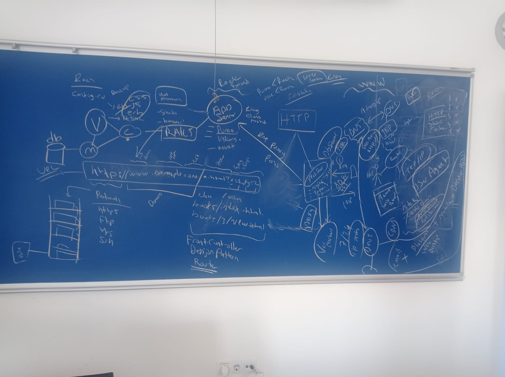

# 1. Gün

---

## İçerik

1. **Terminal Kullanımı**
    - Temel Linux komutları ve terminal kullanımı hakkında bilgi.

2. **Metin Editörleri ve/veya IDE Kullanımı**
    - Visual Studio Code, RubyMine gibi IDE'ler hakkında teorik bilgiler.

3. **Git, Gitflow, Semver ile Versiyonlama ve Sürüm Kontrolü**
    - **Git & Gitflow**
        - Git'in önemi ve Gitflow ile daha hızlı ve sağlıklı versiyonlama yapılabileceği hakkında örnekler. [Gitflow Cheatsheet](https://danielkummer.github.io/git-flow-cheatsheet/)
         
    - **Semver**
        - Semantik Versiyonlamanın önemi ve nasıl kullanıldığı. [Semver](https://semver.org/lang/tr/)

4. **CI/CD Süreçleri**
    - CI/CD süreçlerinin ne olduğu, önemi ve Rails ile çalışırken hangi araçların kullanıldığı.

5. **Test Yazma Kültürü**
    - Rails test araçları hakkında bilgi. Minitest ve diğer test araçlarının karşılaştırılması.

6. **HTTP Yaşam Döngüsü ve Temel Kavramlar**
    - Rack Middleware, REST ve RESTful, MVC hakkında bilgiler.
    
    

7. **IRB Konsolu ile Ruby Kullanımı**
    - IRB ile interaktif Ruby kodlarının yazımı. İlk oluşturulan Rails projesindeki veriler ile örnekler.

    ```ruby
    product = Product.new
    product.name = "Deneme"
    product.save
    ```

8. **Ruby Paket Yöneticisi (RubyGems ve Bundler)**
    - Çok sayıda gem olması ve projelerde kullanılması nedeniyle bunları yönetmek için Bundler kullanırız.

    ```sh
    mkdir bundler
    cd bundler
    bundle init
    ```

---

İlk Rails uygulamasını çalıştırıp dosya yapıları ve içerikleri hakkında konuşuldu.
