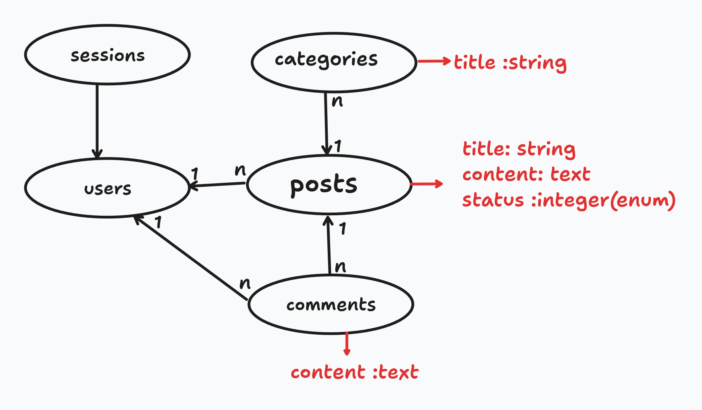

# **2. Gün Notları**  

Bu notlar, kampta yaptığımız [Proje](https://github.com/azimcan/LKD2025-blog) üzerinden alınmıştır.


Proje bu şemaya göre hazırlandı.

---

## **Rails Projesi Oluşturma**  

Yeni bir **Rails projesi** oluştururken kullanılacak CSS kütüphanesini belirleyebiliriz:  

```sh
rails new blog --css=tailwind
```

Rails projelerini oluştururken kullanabileceğiniz parametreler için

```sh
rails --help
```

---
Modeller oluşturulurken tekil isim --> Category

```sh
rails generate model Category title:string
```

controller oluşturulrken çoğul isim --> Categories

```sh
rails generate controller Categories
```

authentication.rb tüm uygulamada kullanılan bir dosya olduğu için concern olarak tanımlanmıştır. Concern kullanımı, birden fazla controller'da aynı kodu tekrar tekrar yazmayı önleyerek kod tekrarını azaltır ve modülerlik sağlar

# partial renderleme yolları

---

```ruby
    <% @categories.each do |category|%>
    <%= render partial: 'category', locals: {category: category} %>
    <%= render category %>
    <%= render @categories %>
    <% end %>
```

1. kullanım şeklinde dosya ismini açıkça belirterek ve değişkenleri locals ile göndererek render eder.

2. kullanım şeklinde Rails, model ismine göre otomatik olarak _category.html.erb dosyasını bulur.

3. kullanım şeklinde koleksiyon olarak render işlemi yapar, her elemanı kendi partial dosyası ile render eder.

---

```ruby
# Parametreleri alırken Rails 8 ile bu şekilde yapılması öneriliyor. Daha güvenli olduğu söyleniyor.
params.expect(:category [:title]) 

# Eski kullanım şekli
params.require(:category).permit(:title) 
```

```ruby
enum status: { draft: 0, published: 1, archived: 2 } # eski kullanımı.

enum :status, draft: 0, published: 1, archived: 2 # Rails 8 ile gelen enum kullanımı.
```

```ruby
resources :posts do
    resources :comments, only: [ :create, :destroy ]
    member do
      patch :publish
      patch :archive
    end
  end

Nested resources sonucu ortaya çıkan URL --> posts/:post_id/comments(.:format) 

#Nested resources kullanarak ilişkili modellerin URL yapısını daha mantıklı hale getirebiliriz.
```
